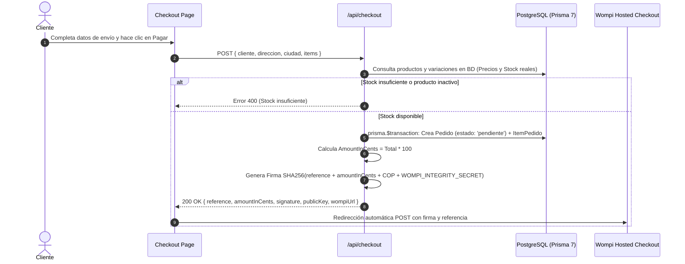
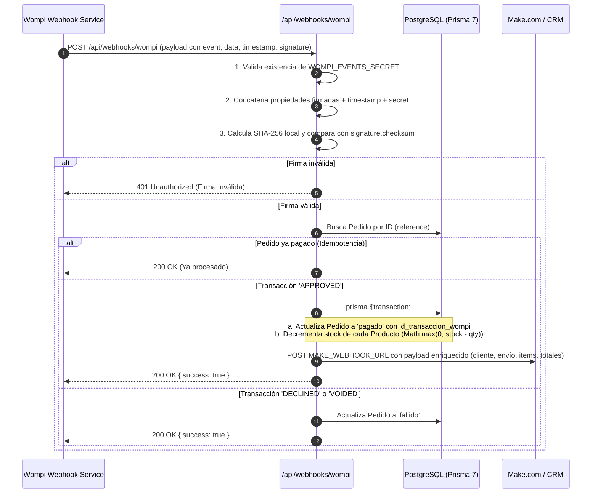
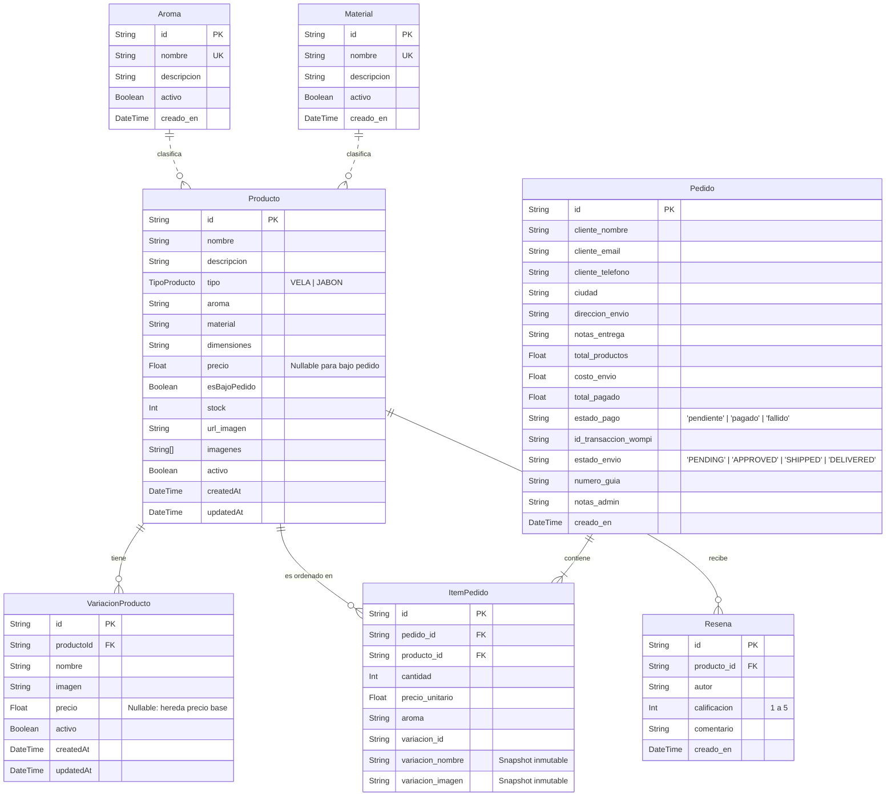

# Documento de Arquitectura de Software (ARCH.md)

**Proyecto:** Sandra Gil Velas Artesanales  
**Líder Técnico & Arquitecto de Software:** Antigravity AI  
**Fecha de Auditoría:** Agosto 2026  
**Versión de Arquitectura:** 2.0.0 (Next.js 16 + Prisma 7 + Tailwind 4)

---

## 1. Visión General y Principios de Diseño

El sistema está diseñado como un **e-commerce monolítico modular de alto rendimiento**, priorizando:
1. **Consistencia Transaccional e Idempotencia:** Garantía absoluta de que el stock nunca se corrompa por compras simultáneas o webhooks duplicados.
2. **Seguridad Criptográfica sin Confianza en el Cliente:** Los precios y montos totales jamás son determinados por el frontend; se recalculan y firman en el servidor con SHA-256.
3. **Cero Latencia Percibida:** Renderizado híbrido (Server Components para SEO y catálogos, Client Components para reactividad en carrito y selectores de variaciones).
4. **Resiliencia Operativa:** Integración fluida con pasarelas locales (Wompi) y disparadores asíncronos para automatizaciones (Make.com / Zapier / WhatsApp).

---

## 2. Diagrama de Arquitectura Global

```mermaid
graph TD
    User([👤 Cliente Web / Móvil]) -->|Navega / Agrega al Carrito| NextApp[🖥️ Next.js 16 App Router]
    
    subgraph Frontend [Capa de Presentación (React 19)]
        Layout[RootLayout & SEO]
        StoreShell[StoreShell & CatalogShell]
        ProductDetail[ProductDetailShell]
        CartCtx[CartContext / LocalStorage]
        CheckoutUI[Checkout Form & City Matrix]
    end

    subgraph Backend [Capa de Servidor & API (Next.js Route Handlers)]
        APICheckout["POST /api/checkout<br/>(Validación de Stock & Firma Wompi)"]
        APIResenas["POST /api/resenas<br/>(Validación & Persistencia)"]
        APIWebhook["POST /api/webhooks/wompi<br/>(Idempotencia, Stock & Make.com)"]
    end

    subgraph Data [Capa de Datos (PostgreSQL & Prisma 7)]
        PrismaClient[Prisma Client 7]
        AdapterPg["@prisma/adapter-pg + pg.Pool"]
        SupabaseDB[(🐘 Supabase PostgreSQL)]
    end

    subgraph External [Servicios Externos]
        WompiCheckout[💳 Wompi Hosted Checkout]
        WompiWebhookServer[📡 Wompi Event Server]
        MakeAutomation[⚡ Make.com / Zapier Webhook]
    end

    NextApp --> Frontend
    Frontend --> CartCtx
    CheckoutUI -->|1. Solicita Checkout| APICheckout
    APICheckout -->|2. Valida Precios & Crea Pedido| PrismaClient
    PrismaClient --> AdapterPg --> SupabaseDB
    APICheckout -->|3. Retorna Payload Firmado con SHA-256| CheckoutUI
    CheckoutUI -->|4. Redirige a Pasarela| WompiCheckout
    
    WompiCheckout -->|5. Pago completado| User
    WompiWebhookServer -->|6. Evento transaction.updated| APIWebhook
    APIWebhook -->|7. Valida Firma & Transacción Atómica| PrismaClient
    APIWebhook -->|8. Notifica pedido pagado| MakeAutomation
```

---

## 3. Flujos de Datos Clave

### 3.1. Flujo de Checkout y Firma Criptográfica de Integridad

El cliente jamás envía el monto final a pagar a Wompi. El backend valida el inventario en tiempo real, suma los costos de producto y el flete regional, y genera una firma criptográfica única.



---

### 3.2. Flujo de Webhook de Pagos, Deducción Atómica de Stock y Automatizaciones



---

## 4. Modelo de Datos y Esquema Relacional

El esquema está normalizado en Prisma 7 para soportar velas, cosmética artesanal (jabones), variaciones por tamaño/modelo, aromas, reseñas y trazabilidad inmutable de pedidos.



---

## 5. Capa de Base de Datos y Conexiones (Prisma 7 + Driver Adapters)

El acceso a PostgreSQL en `lib/db.ts` implementa el estándar oficial de **Prisma 7**:
- **Driver Adapter**: Se utiliza `@prisma/adapter-pg` en combinación con la librería nativa `pg` (`Pool`).
- **Connection Pooling**: El pool maneja de forma eficiente las conexiones hacia Supabase (`POSTGRES_PRISMA_URL` con PgBouncer en el puerto `6543`).
- **Migraciones y Direct Connection**: `prisma.config.ts` utiliza `POSTGRES_URL_NON_POOLING` (puerto directo `5432`) para la ejecución segura de migraciones y scripts de seed.
- **Configuración SSL**: Configuración explícita `sslmode=no-verify` con `rejectUnauthorized: false` para evitar interrupciones por renovación de certificados CA en entornos serverless.

---

## 6. Sistema de Tarifas y Envíos (`lib/colombia-cities.ts`)

La aplicación cuenta con una matriz tipada de destinos para Colombia organizada por 3 zonas logísticas:

| Zona | Alcance Geográfico | Tarifa (COP) | Tiempo Estimado |
| :--- | :--- | :--- | :--- |
| **Bogotá D.C.** | Perímetro urbano de Bogotá | `$9.000` | 24 - 48 horas hábiles |
| **Alrededores / Sabana** | Chía, Cajicá, Cota, Zipaquirá, Soacha, La Calera, etc. | `$14.000` | 24 - 48 horas hábiles |
| **Nacional (Ciudades Principales)** | Medellín, Cali, Barranquilla, Bucaramanga, Cartagena, etc. | `$18.000` | 2 - 4 días hábiles |

El formulario de checkout (`app/checkout/page.tsx`) recalcula automáticamente el costo de envío y actualiza el total en vivo sin depender de llamadas de red redundantes.

---

## 7. Frontend State & Patrones de Componentes

1. **`CartContext` (`context/CartContext.tsx`):**
   - Manejo de estado global con sincronización en `localStorage` (`sandra_gil_velas_cart`).
   - Algoritmo de igualdad estricta por identidad compuesta: `id_producto + aroma_seleccionado + variacion_id`.
2. **Imágenes con Skeleton Loader (`components/SkeletonImage.tsx`):**
   - Envoltorio sobre `next/image` con placeholder pulsante hasta que el evento `onLoad` se dispara, eliminando saltos de diseño (CLS).
3. **Fichas de Producto Dinámicas (`app/productos/[id]/ProductDetailShell.tsx`):**
   - Actualización en tiempo real de imagen y precio al alternar entre la edición base y las variaciones.
   - Ocultamiento contextual del selector de aromas si el producto corresponde a cosmética (`isSoapProduct`).
   - Formulario de reseñas integrado con validación instantánea y feedback visual.

---

## 8. Seguridad y Mejores Prácticas

- **Protección de Secretos:** `WOMPI_INTEGRITY_SECRET` y `WOMPI_EVENTS_SECRET` residen exclusivamente en el entorno del servidor y nunca se exponen al bundle de cliente.
- **Validación Estricta de Teléfonos:** Regla colombiana de 10 dígitos numéricos iniciando por 3 (ej. `3001234567`).
- **Transacciones ACID:** Creación de pedido + items y actualización de estado + reducción de stock encapsuladas en `prisma.$transaction`.
